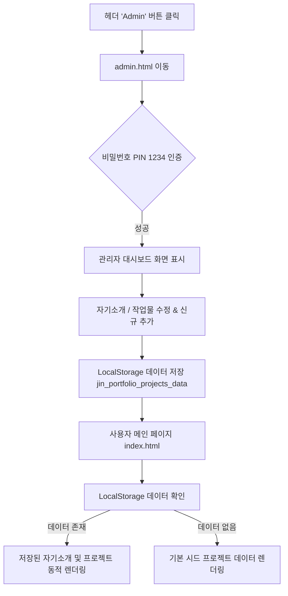

# 🚀 [PRD] 2026 남진혁 AI 포트폴리오 웹사이트 제품 요구사항 정의서

> **문서 버전:** v1.1  
> **작성일자:** 2026년 7월 27일  
> **기획자:** 남진혁 (AI 트렌드 및 웹앱 개발자)  
> **대상 읽는 이:** 초보 개발자, 기획자, 디자이너, 협업 파트너  

---

## 1. 프로젝트 개요 (Overview)

### 1.1 프로젝트명
- **2026 Nam Jin-hyeok AI Web/App Portfolio & Admin System (`2026portfolio`)**

### 1.2 프로젝트 한 줄 요약
- **25세 대학생/취준생 층을 타겟**으로, 남진혁 개발자가 연구하고 제작한 **AI 트렌드 기반의 웹사이트 및 모바일 앱 프로젝트를 한눈에 확인하고 즉시 체험(라이브 데모/GitHub)**할 수 있는 인터랙티브 포트폴리오 웹사이트이며, **독립된 관리자 페이지(`admin.html`)를 통해 자기소개 및 작업물을 자유롭게 추가/수정/삭제**할 수 있는 웹 시스템입니다.

### 1.3 프로젝트 배경 및 목적
- **산발적인 작업물 통합:** 제작한 여러 AI 웹앱과 서비스가 개별 링크로 흩어져 있어 접근성이 떨어지는 문제 해결
- **학생 타겟 커뮤니케이션:** 25세 전후의 학생들이 흥미를 느끼고 쉽게 체험해볼 수 있도록 직관적이고 감각적인 디자인 제공
- **독립 관리자 대시보드 구축 (`admin.html`):** 복잡한 백엔드 서버 없이도 관리자 로그인 후 **자기소개 수정 및 신규 AI 작업물(프로젝트) 등록/수정/삭제(CRUD)**를 브라우저 LocalStorage에 실시간 저장 관리 가능

---

## 2. 타겟 사용자 분석 (Target Audience & Persona)

### 2.1 주요 대상 (Primary Audience)
- **평균 연령:** 25세 (대학생, 취업준비생, AI/IT 기술에 관심이 많은 또래 청년층)
- **특성:** 
  - 텍스트 위주의 길고 지루한 포트폴리오보다 시각적이고 직관적인 웹사이트 선호
  - AI 트렌드 및 최신 모바일/웹 기술에 호기심이 높음
  - 즉시 체험 가능한 '라이브 데모 링크'나 'GitHub 코드 링크'를 중요하게 생각함

### 2.2 타겟 페르소나 (Persona)
- **이름:** 이민우 (25세, 컴퓨터공학/디자인전공 대학 4학년)
- **니즈:** "요즘 또래 개발자들은 어떤 AI 기술로 앱을 만들고 있을까? 나도 직접 들어가서 체험해보고 싶다."
- **행동 패턴:** 
  1. 포트폴리오 사이트에 접속하자마자 화려하고 감각적인 AI 디자인에 몰입됨.
  2. 자기소개와 관심 분야를 읽고 남진혁 개발자의 역량을 파악함.
  3. [작업물 페이지]에서 관심 있는 AI 웹앱 카드의 **'데모 체험하기'** 또는 **'GitHub'** 버튼을 클릭해 경험함.

---

## 3. 디자인 컨셉 & UX/UI 방향성 (Design System)

### 3.1 디자인 테마: `AI 트렌디 & 글로우 (AI Trendy & Glow)`
- **컬러 팔레트:**
  - Background: Deep Dark (`#0B0F17`, `#111827`)
  - Accent Colors: Neon Cyan (`#06B6D4`), Electric Violet (`#8B5CF6`), Cyber Pink (`#EC4899`)
  - Text: High Contrast White (`#F9FAFB`), Muted Silver (`#9CA3AF`)
- **Visual Effects:**
  - **글래스모피즘 (Glassmorphism):** 은은하게 비치는 반투명 유리 느낌의 카드 UI
  - **네온 그래디언트 (Neon Gradient):** AI 최신 트렌드를 느끼게 하는 부드러운 빛 번짐 효과
  - **마이크로 애니메이션:** 카드 호버 시 살짝 떠오르는 마이크로 인터랙션

### 3.2 UX 가이드라인
- **메인 포트폴리오(`index.html`) & 관리자 대시보드(`admin.html`) 디자인 일관성 유지**
- **모바일 퍼스트 반응형:** 스마트폰, 타블렛, PC 등 모든 기기 화면에 맞춤형 레이아웃 제공
- **비기너 친화적 표현:** 어려운 개발 전문 용어 옆에는 이해하기 쉬운 한 줄 설명을 첨부

---

## 4. 정보 구조 (Information Architecture, IA)

```
2026portfolio
├── 1. index.html (메인 사용자 포트폴리오 사이트)
│   ├── Header Navigation (메뉴 & '🔐 Admin' 접속 버튼)
│   ├── Hero Section (메인 타이틀 & CTA)
│   ├── About Me Section (자기소개 및 관심 분야)
│   ├── Projects Section (동적 AI 작업물 카테고리 필터 카드 & 라이브/GitHub 링크)
│   ├── Tech Stack & AI Focus (기술 스택)
│   └── Footer (소셜 링크 & 카피라이트)
│
└── 2. admin.html (독립 관리자 대시보드 시스템) ⭐ [NEW]
    ├── [인증 뷰] 관리자 로그인 폼 (비밀번호 PIN verification)
    └── [대시보드 뷰] 관리자 메인 컨트롤 타워
        ├── Header (로그아웃 버튼 & '🚀 메인으로 이동' 버튼)
        ├── Tab 1: 자기소개 (About Me) 수정 폼 (이름, 관심분야, 본문)
        └── Tab 2: 작업물 (Projects) 풀 CRUD 관리자
            ├── [Create] 신규 AI 프로젝트 추가 폼 (제목, 카테고리, 태그, 데모URL, GitHub)
            ├── [Read/Update] 기존 작업물 인라인 목록 수정
            └── [Delete/Reset] 작업물 삭제 및 기본 데이터 초기화
```

---

## 5. 상세 기능 요구사항 (Feature Specifications)

### 5.1 [섹션 1] 네비게이션 헤더 (Header & Nav)
- **로고:** `JINHYEOK.AI` (네온 그래디언트 로고)
- **메뉴 링크:** About / Projects / Tech Stack / Contact
- **관리자 전용 이동 버튼:** 우측 상단 `🔐 Admin` 버튼 배치 (클릭 시 `admin.html`로 이동)

### 5.2 [섹션 2] 메인 히어로 (Hero Section)
- **헤드라인:** "AI로 상상을 현실로 만드는 개발자, 남진혁입니다."
- **서브헤드:** "최신 AI 트렌드를 반영한 웹앱과 유용한 서비스를 만듭니다."
- **CTA 버튼:** `작업물 둘러보기 (Projects)` / `GitHub 방문하기`

### 5.3 [섹션 3] 자기소개란 (About Me Section)
- **기본 정보:** 이름 (남진혁), 관심 분야 (AI 트렌드, 생성형 AI 웹앱), 할 수 있는 것 (웹/앱 개발, AI API 연동)
- **자기소개 텍스트:** AI 기술을 쉽게 서비스로 녹여내는 개발 방향성 공유
- **동적 로드:** `localStorage`에 저장된 자기소개 데이터가 최우선으로 반영됨

### 5.4 [섹션 4] 작업물 페이지 (Projects Section)
- **프로젝트 카드 구성 요소:**
  - **이모지/아이콘 & 썸네일:** AI 웹앱 시연 그래픽
  - **프로젝트 제목 & 한 줄 설명:** (예: "AI스케치 해석기", "지능형 타로/운세 웹앱")
  - **사용 기술 태그 (Badges):** `#VisionAI`, `#OpenAI`, `#React`, `#FastAPI` 등
  - **핵심 이동 버튼 (Action Buttons):**
    - 🚀 **`데모 체험하기 (Live Demo)`**: 해당 웹/앱으로 바로 이동하는 클릭 가능 링크 (예: AI Studio 앱 주소)
    - 🐙 **`GitHub 코드보기`**: 개발 소스코드 저장소로 바로 이동
- **동적 CRUD 렌더링:** 관리자 페이지(`admin.html`)에서 추가/수정/삭제한 내용이 메인 화면에 즉시 동적 렌더링됨

### 5.5 [섹션 5] 기술 스택 & 관심 분야 (Skills & Interests)
- **관심 분야 (Interests):** AI 트렌드 리서치, LLM 파인튜닝, 프롬프트 엔지니어링, 웹앱 서비스 구축
- **기술 스택 (Tech Stack):** Frontend (HTML/CSS/JS, React), AI/Backend (OpenAI API, Claude, Python)

### 5.6 [섹션 6] 푸터 (Footer)
- **카피라이트:** `© 2026 Nam Jin-hyeok. All rights reserved.`
- **연락처 & 링크:** 이메일, GitHub 주소, 블로그/SNS

### 5.7 [섹션 7] 관리자 전용 대시보드 페이지 (`admin.html`) ⭐ *핵심 신규 사양*

#### 5.7.1 로그인 & 인증 처리 (Authentication)
- **로그인 화면:** `admin.html` 첫 접속 시 4자리 PIN 비밀번호(기본값: `1234`) 입력창 표시
- **세션 유지:** 인증 성공 시 `sessionStorage`에 로그인 상태 저장 (`jin_admin_authenticated = true`)
- **로그아웃:** 대시보드 상단 `🚪 Logout` 버튼으로 즉시 인증 해제 및 로그인 화면으로 복귀

#### 5.7.2 자기소개 (About Me) 편집 탭
- **입력 항목:** 이름, 직함, 관심 분야 한 줄 요약, 자기소개 본문 텍스트 (Textarea)
- **저장 기능:** `💾 자기소개 저장` 버튼 클릭 시 `localStorage.setItem('jin_portfolio_about_data', ...)` 실행 및 즉시 반영

#### 5.7.3 작업물 (Projects) 풀 CRUD 대시보드 탭
- **1. [Create] 신규 작업물 등록 폼:**
  - 제목 (예: "AI스케치 해석기")
  - 카테고리 선택 (`web` [AI 웹사이트] / `app` [AI 모바일 앱])
  - 한 줄 설명 (Description)
  - 이모지 아이콘 (Icon)
  - 기술 스택 태그 (쉼표로 구분, 예: `#VisionAI, #OpenAI, #React`)
  - 데모 접속 URL (Live Demo Link)
  - GitHub 저장소 URL
- **2. [Read/Update] 기존 작업물 리스트 & 수정:**
  - 등록된 작업물 목록을 글래스모피즘 카드로 나열
  - `✏️ 수정` 버튼 클릭 시 인라인 폼이 열려 해당 작업물 항목 즉시 수정 가능
- **3. [Delete] 작업물 삭제:**
  - `🗑️ 삭제` 버튼 클릭 시 확인 팝업 후 해당 작업물 `localStorage` 목록에서 제거
- **4. [Reset] 기본 시드 데이터 복원:**
  - `🔄 기본 데이터로 초기화` 버튼 제공하여 언제든 초기 샘플 데이터로 복원 가능

---

## 6. 데이터 흐름 및 저장 사양 (Data Architecture)



### LocalStorage 키 명세 (Storage Keys)
1. **자기소개 데이터:** `jin_portfolio_about_data`
   - Structure: `{ name, role, field, bio }`
2. **작업물 목록 데이터:** `jin_portfolio_projects_data`
   - Structure: `Array<{ id, title, category, desc, icon, tags, demoUrl, githubUrl }>`
3. **관리자 인증 상태:** `jin_admin_auth` (SessionStorage)

---

## 7. 기술 스택 및 개발 구조 (Tech Stack & Architecture)

| 구분 | 기술 / 도구 | 선정 이유 |
| :--- | :--- | :--- |
| **Frontend** | HTML5, Vanilla CSS3, Modern JavaScript (ES6+) | 가볍고 빠른 로딩, 백엔드 서버 없는 독립 동작 |
| **Admin System** | `admin.html`, `js/admin_dashboard.js` | 독립된 대시보드 레이아웃과 완벽한 CRUD 관리자 기능 제공 |
| **Style Concept**| Glassmorphism, CSS Custom Variables (`design.md`) | 메인 포트폴리오와 완벽히 통일된 다크 네온 어드민 UI |
| **Data Persistence**| Browser `localStorage` API | 서버 DB 없이도 사용자가 수정한 작업물과 자기소개 지속 보존 |
| **Deployment** | Vercel / GitHub Pages | 1분 이내 정적 웹사이트 배포 호환 |

---

## 8. 단계별 개발 로드맵 (Development Roadmap)

### 1단계: 프론트엔드 퍼블리싱 & 기본 포트폴리오 (v1.0 - 완료)
- [x] PRD 기획 및 요구사항 정의 (`prd.md`)
- [x] 메인 포트폴리오 사이트 (`index.html`) 및 디자인 시스템 (`design.md`) 구축
- [x] 컴포넌트 스토리북 데모 (`components_demo.html`) 제작
- [x] GitHub 저장소 푸시 (`https://github.com/skawlsgur-oss/2026portfolio.git`)

### 2단계: 독립 관리자 페이지 및 풀 CRUD 구현 (v1.1 - 진행 중)
- [x] PRD v1.1 관리자 페이지 기능 요구사항 추가 (`prd.md`)
- [ ] 관리자 전용 스타일 시트 `css/admin.css` 제작
- [ ] 관리자 페이지 `admin.html` (로그인 뷰 + 대시보드 뷰) 개발
- [ ] 관리자 JS 대시보드 로직 `js/admin_dashboard.js` (로그인, 자기소개 편집, 작업물 CRUD) 작성
- [ ] 메인 `index.html` 및 `js/projects.js`와 `localStorage` 실시간 연동 처리

### 3단계: 최종 검증 및 GitHub 배포 (v1.1 - 완료 예정)
- [ ] `admin.html`에서 작업물 추가/수정/삭제 후 `index.html` 연동 테스트
- [ ] GitHub 저장소 최신 코드 커밋 및 푸시
