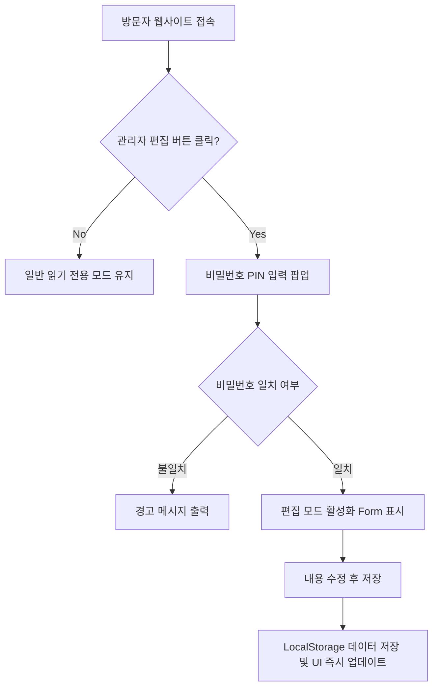

# 🚀 [PRD] 2026 남진혁 AI 포트폴리오 웹사이트 제품 요구사항 정의서

> **문서 버전:** v1.0  
> **작성일자:** 2026년 7월 27일  
> **기획자:** 남진혁 (AI 트렌드 및 웹앱 개발자)  
> **대상 읽는 이:** 초보 개발자, 기획자, 디자이너, 협업 파트너

---

## 1. 프로젝트 개요 (Overview)

### 1.1 프로젝트명

- **2026 Nam Jin-hyeok AI Web/App Portfolio (`2026portfolio`)**

### 1.2 프로젝트 한 줄 요약

- **25세 대학생/취준생 층을 타겟**으로, 남진혁 개발자가 연구하고 제작한 **AI 트렌드 기반의 웹사이트 및 모바일 앱 프로젝트를 한눈에 확인하고 즉시 체험(라이브 데모/GitHub)**할 수 있는 인터랙티브 포트폴리오 웹사이트입니다.

### 1.3 프로젝트 배경 및 목적

- **산발적인 작업물 통합:** 제작한 여러 AI 웹앱과 서비스가 개별 링크로 흩어져 있어 접근성이 떨어지는 문제 해결
- **학생 타겟 커뮤니케이션:** 25세 전후의 학생들이 흥미를 느끼고 쉽게 체험해볼 수 있도록 직관적이고 감각적인 디자인 제공
- **손쉬운 자기소개 관리:** 복잡한 DB 구축 없이도 관리자 인증을 통해 자기소개 및 핵심 정보를 웹상에서 바로 수정/업데이트 가능

---

## 2. 타겟 사용자 분석 (Target Audience & Persona)

### 2.1 주요 대상 (Primary Audience)

- **평균 연령:** 25세 (대학생, 취업준비생, AI/IT 기술에 관심이 많은 또래 청년층)
- **특성:**
  - 텍스트 위주의 길고 지루한 포트폴리오보다 시각적이고 직관적인 웹사이트 선호
  - AI 트렌드 및 최신 모바일/웹 기술에 호기심이 높음
  - 즉시 체험 가능한 '라이브 데모 링크'나 'GitHub 코드 링크'를 중요하게 생각함

### 2.2 타겟 페르소나 (Persona)

- **이름:** 이민우 (25세, 컴퓨터공학/디자인전공 대학 4학년)
- **니즈:** "요즘 또래 개발자들은 어떤 AI 기술로 앱을 만들고 있을까? 나도 직접 들어가서 체험해보고 싶다."
- **행동 패턴:**
  1. 포트폴리오 사이트에 접속하자마자 화려하고 감각적인 AI 디자인에 몰입됨.
  2. 자기소개와 관심 분야를 읽고 남진혁 개발자의 역량을 파악함.
  3. [작업물 페이지]에서 관심 있는 AI 웹앱 카드의 **'데모 체험하기'** 또는 **'GitHub'** 버튼을 클릭해 경험함.

---

## 3. 디자인 컨셉 & UX/UI 방향성 (Design System)

### 3.1 디자인 테마: `AI 트렌디 & 글로우 (AI Trendy & Glow)`

- **컬러 팔레트:**
  - Background: Deep Dark (`#0B0F19`, `#111827`)
  - Accent Colors: Neon Cyan (`#06B6D4`), Electric Violet (`#8B5CF6`), Cyber Pink (`#EC4899`)
  - Text: High Contrast White (`#F9FAFB`), Muted Silver (`#9CA3AF`)
- **Visual Effects:**
  - **글래스모피즘 (Glassmorphism):** 은은하게 비치는 반투명 유리 느낌의 카드 UI
  - **네온 그래디언트 (Neon Gradient):** AI 최신 트렌드를 느끼게 하는 부드러운 빛 번짐 효과
  - **마이크로 애니메이션:** 카드 호버 시 살짝 떠오르는 마이크로 인터랙션

### 3.2 UX 가이드라인

- **모바일 퍼스트 반응형:** 스마트폰, 타블렛, PC 등 모든 기기 화면에 맞춤형 레이아웃 제공
- **비기너 친화적 표현:** 어려운 개발 전문 용어 옆에는 이해하기 쉬운 한 줄 설명을 첨부

---

## 4. 정보 구조 (Information Architecture, IA)

```
2026portfolio (Single Page Application / 다중 섹션)
├── 1. Header Navigation (헤더 및 관리자 로그인 버튼)
├── 2. Hero Section (메인 비주얼 & 타이틀)
├── 3. About Me Section (자기소개 및 관심 분야 + [관리자 편집 모드])
├── 4. Projects Section (AI 웹/앱 작업물 카드 & 라이브/GitHub 링크)
├── 5. Tech Stack & AI Focus (사용 가능 기술 & 관심 AI 트렌드)
└── 6. Footer (소셜 링크 & 든든한 피드백)
```

---

## 5. 상세 기능 요구사항 (Feature Specifications)

### 5.1 [섹션 1] 네비게이션 헤더 (Header & Nav)

- **로고:** `JINHYUK.AI` (네온 그래디언트 로고)
- **메뉴 링크:** About / Projects / Tech Stack / Contact
- **관리자 전용 토글:** 우측 상단 `🔐 Admin Edit` 버튼 배치

### 5.2 [섹션 2] 메인 히어로 (Hero Section)

- **헤드라인:** "AI를 활용하여 서비스를 만드는 AI커뮤니케이터, 남진혁입니다."
- **서브헤드:** "최신 AI 트렌드를 반영한 웹앱과 유용한 서비스를 만듭니다."
- **CTA 버튼:** `작업물 둘러보기 (Projects)` / `GitHub 방문하기`

### 5.3 [섹션 3] 자기소개란 (About Me Section) ⭐ _핵심 요구사항_

- **기본 정보:** 이름 (남진혁), 관심 분야 (AI 트렌드, 생성형 AI 웹앱), 할 수 있는 것 (웹/앱 개발, AI API 연동)
- **자기소개 텍스트:** AI 기술을 쉽게 서비스로 녹여내는 개발 방향성 공유
- **관리자 직접 편집 기능 (Admin Mode):**
  1. `🔐 Admin Edit` 버튼 클릭 시 비밀번호(PIN) 입력 모달 등장
  2. 비밀번호 일치 시, 자기소개란이 **'수정 가능한 폼(Input / Textarea)'**으로 전환
  3. 내용 수정 후 `저장하기` 클릭 시 **브라우저 LocalStorage**에 즉시 저장 및 실시간 반영 (별도 백엔드 설치 필요 없음)

### 5.4 [섹션 4] 작업물 페이지 (Projects Section) ⭐ _핵심 요구사항_

- **프로젝트 카드 구성 요소:**
  - **썸네일 이미지/동영상:** AI 웹앱 시연 그래픽
  - **프로젝트 제목 & 한 줄 설명:** (예: "AI 숏폼 콘텐츠 자동 생성기", "지능형 타로/운세 웹앱")
  - **사용 기술 태그 (Badges):** `#LLM`, `#OpenAI`, `#React`, `#WebRTC` 등
  - **핵심 이동 버튼 (Action Buttons):**
    - 🚀 **`데모 체험하기 (Live Demo)`**: 해당 웹/앱으로 바로 이동하는 클릭 가능 링크
    - 🐙 **`GitHub 코드보기`**: 개발 소스코드 저장소로 바로 이동
- **필터 기능:** 전체 / AI 웹 / AI 앱 / 라이드 데모 가능 프로젝트

### 5.5 [섹션 5] 기술 스택 & 관심 분야 (Skills & Interests)

- **관심 분야 (Interests):** AI 트렌드 리서치, LLM 파인튜닝, 프롬프트 엔지니어링, 웹앱 서비스 구축
- **기술 스택 (Tech Stack):**
  - Frontend: HTML/CSS, JavaScript, React, Tailwind / Vanilla CSS
  - AI & Backend: OpenAI API, Claude API, Python, Node.js

### 5.6 [섹션 6] 푸터 (Footer)

- **카피라이트:** `© 2026 Nam Jin-hyuk. All rights reserved.`
- **연락처 & 링크:** 이메일, GitHub 주소, 블로그/SNS

---

## 6. 데이터 흐름 및 보안 사양 (Data & Security Spec)

### 6.1 관리자 인증 및 데이터 저장 구조 (LocalStorage 기반)



- **보안 가이드:**
  - 간단한 개인 포트폴리오이므로 브라우저 내 암호화된 비밀번호 비교 방식 적용
  - 추후 백엔드(Supabase/Firebase) 도입 시 API Key 방식으로 확장 가능한 구조 설계

---

## 7. 기술 스택 및 개발 구조 (Tech Stack & Architecture)

| 구분                 | 기술 / 도구                                     | 선정 이유                                                    |
| :------------------- | :---------------------------------------------- | :----------------------------------------------------------- |
| **Frontend**         | HTML5, Vanilla CSS3, Modern JavaScript (ES6+)   | 가볍고 빠른 로딩, 모든 브라우저 완벽 호환                    |
| **Style Concept**    | Glassmorphism, CSS Custom Variables (Variables) | 유지보수가 쉽고 트렌디한 다크 모드 스타일 구현               |
| **Icons**            | Lucide Icons / FontAwesome CDN                  | 깔끔하고 모던한 미니멀 아이콘 세트 사용                      |
| **Data Persistence** | Browser `localStorage` API                      | 백엔드 서버 없이도 사용자가 직접 수정한 자기소개 데이터 보존 |
| **Deployment**       | Vercel / GitHub Pages                           | 초보자도 1분만에 무료로 라이브 배포 가능                     |

---

## 8. 단계별 개발 로드맵 (Development Roadmap)

### 1단계: 프론트엔드 퍼블리싱 (v1.0 - 필수 구현)

- [x] PRD 기획 및 요구사항 정의 (`prd.md`)
- [ ] 2026portfolio 기본 폴더 및 파일 구조 생성 (`index.html`, `style.css`, `app.js`)
- [ ] AI 글로우 & 글래스모피즘 디자인 시스템 구축
- [ ] 히어로, 자기소개, 작업물(데모/GitHub 링크), 푸터 레이아웃 구현

### 2단계: 관리자 편집 기능 구현 (v1.0 - 필수 구현)

- [ ] `🔐 Admin Edit` 비밀번호 모달 구현
- [ ] LocalStorage 연동 및 인라인 자기소개 수정 폼 데이터 바인딩

### 3단계: 검증 및 무료 배포 (v1.0 - 완료)

- [ ] 모바일/데스크톱 반응형 테스트
- [ ] GitHub Pages 또는 Vercel을 통한 실제 서비스 배포

---

## 9. 성공 측정 지표 (Success Metrics)

1. **접근 편의성:** 메인 화면 접속 후 3초 이내에 작업물 데모 링크를 찾아 클릭할 수 있는가?
2. **트렌디 감성:** 25세 목표 대상 사용자가 봤을 때 "AI 전문 개발자스럽다"는 느낌을 주는가?
3. **편집 용이성:** 남진혁 본인이 로그인하여 10초 이내에 자기소개 문구를 수정할 수 있는가?
